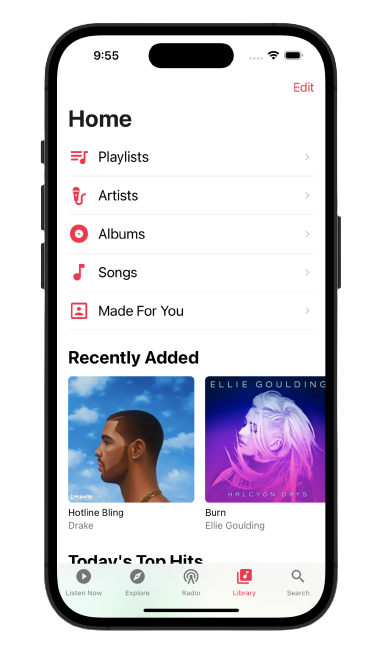
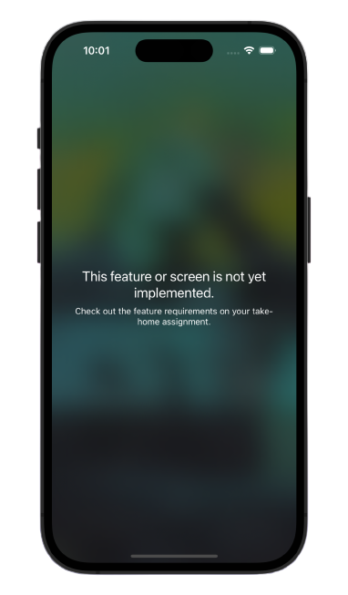

<br>
<br>
<p align="center"> 
  
     

</p>


<h1 align="center">React Native Code Challenge</h1>
<h3 align="center">Please read carefully these instructions and feel free to reach out in case of having questions.</h3>

<br>

## ⚡ Introduction
Here at Moove It, we strive to create consumer-facing mobile apps that bring impact to millions of users worldwide. It is part of our identity to do our best to reach excellence in our deliverables and get the most out of each development process. 

In this opportunity, we are giving you the codebase of an existing app and your task is to add two new features and work on addressing architectural and presentational issues that may exist. 

## 📕 The Challenge
You’ve been requested to implement two core features for our in-house Apple Music App for iOS and Android. The starter project is this GitHub repository. You **must use it as a template** and start working on a **new repository of your own** that will have the actual deliverable.

This is how the base app looks like:

|  |   |   |
|-----------------------------------------------------------|-----------------------------------------------------------|---|

The challenge consists of working on this existing codebase to implement the following features:

- **[AM-1]: Search feature**:
As a user, I want to search for a song, artist, or album title and see a list of search results to find a specific song. The list should display the results dynamically as the user types.

- **[AM-2]: Music Player**:
As a user, I want to tap on a song item to get further information about it and play a short audio preview of the song on the device.

The starter project code quality level isn’t representative of the expected quality of your deliverable: we’ve purposely implemented a solution that can be improved in several ways.

**Bonus**:
- Add Dark Mode support based on device settings.
- Animate data visualization and/or add transitions between screens.

*Note: these are strictly bonuses, and are not required by any means.*

**General guidelines**:  
- Must use React Native.
- Feel free to implement your own design.
- You can use the public iTunes Search API (see [docs](https://developer.apple.com/library/archive/documentation/AudioVideo/Conceptual/iTuneSearchAPI/Searching.html#//apple_ref/doc/uid/TP40017632-CH5-SW1)) to implement both tasks.
- Please only spend around 5 hours working on this project. It is totally fine if you don’t finish **(we prioritize quality over completion)**, so take your time.


## 📱 The Deliverable
**Your deliverable will be a new, private GitHub repository of your own** with the source code of the completed assignment and a readme with instructions on how to run it. When the time is up, give us access to your repository.

## 🌐 API Basic Usage
To set you up for success, we include a basic example of a GET request to the iTunes Search API and a screenshot of the response payload.

```
GET search results by [term] of a specific [media] type.
https://itunes.apple.com/search?term=drake&media=music
```
This request returns the following response (simplified for reading purposes):
<br>
```
{
    "resultCount": 50,
    "results": [
        {
            "wrapperType": "track",
            "kind": "song",
            "artistName": "Drake, Kanye West, Lil Wayne & Eminem",
            "collectionName": "More Than a Game (Music Inspired By the Film)",
            "trackName": "Forever",
            "collectionCensoredName": "More Than a Game (Music Inspired By the Film)",
            "trackCensoredName": "Forever",
            "collectionArtistName": "Various Artists",
            "previewUrl": <link to preview audio file>,
            "artworkUrl30": <link to jpg file>,
            "artworkUrl60": <link to jpg file>,
            "artworkUrl100": <link to jpg file>,
            "collectionPrice": 9.99,
            "trackPrice": 0.69,
            "releaseDate": "2009-05-15T12:00:00Z",
        },
        ...(49 more results)
      ]
}
```